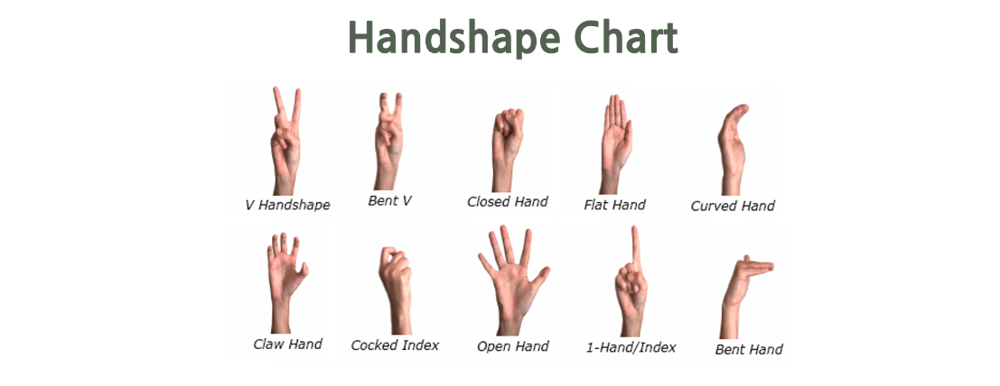
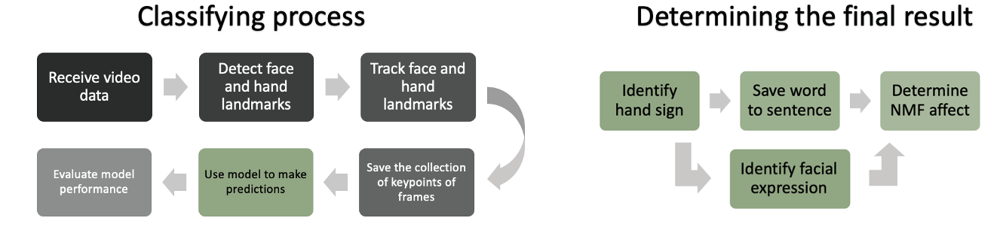

# SIGNSlate: ASL translation app
### American Sign Language interpration swift IOS app using coreML for hand action and face expression classification.

This app receives a live input from the users camera. The video feed is used to identify and track the user's hands and face regions. The movement of the hand and the expression of the face, are classified to display the result back to the user. 

Signslate is an app that aims to increase awareness through creating an interface between the hearing and Deaf communities. Sign language has many complexities and intricacies that are missed if only static hand poses are considered. This system incorporates static and dynamic hand gestures, as well as the users facial expressions to achieve a more accurate translation. 

The system identifies and tracks hand and face regions for subsequent feature extraction. The key points are fed to machine learning models to determine the predicted sign labels. The user can view the results from the session in a final results page.

## Sign Language key factors
Hand signs can be identified through characteristics such as the image showing the shape of the hand. Other importatnt parameters are:

* Hand shape
* Palm orientation
* Hand location
* Hand movement
* Non-Manual Features

### Non-Manual Features explained
NMF refer to expression excluding hands such movement in the body, eyebrows, eyes ,head tilts, rolls, shakes and nods and facial expressions. Each of these features can have a profound effect on the meaning of a sign either by adding emphasis, elaborating the meaning or even completely changing the meaning. Facial markers for CHA and OO as in the image indicate if an object is small or large when accompanying a noun. Similarly, if furrowed eyebrows or raised eyebrows it can implicate a question marker, changing the meaning of the sentence. In this case an expression approach used by using a surprised or angry expression.  

## How does is work?
The system uses two seperate methods from the same live feed to extract the correct data for the two seperate ML models. The signs are recorded into an array with the appended emotion that was present during the sign. This is then used to determine a final result.

### The hand signs
The hand gestures are extracted by recording the 21 points on each hand relating to a joint. This allows for a dataset of the 21 points on the hand, for three co-ordinates, over a period of two seconds. This translation or hand movement, is classified using a SVM trained from the open source MS-ASL dataset after being cleaned. In case not all gestures are two seconds long meaning they can get cut off or already think it is classifying the next sign, a sliding window is used. This makes multiple classifications in the two second period and only uses a dominant average result. 

### The facial expression recognition
The Facial expression model is a well performing dataset known as CK+ and was trained with Convolutional Neural Networks. This model receives a 2D image of the face in a frame to predict the expression. The facial expression is only recorded if it is present on a sign classification. 

## Results
The labels of the classified sign and appended expression are saved to determine if the non-manual feature has an effect on the meaning of the sign. The results below show on the left how the regions are tracked, in the center it shows the current sign being made as "book" with no attatched emotion, followed by the final results. Here the impact of the Non-Manual Features can clearly be seen. The surprised expression together with book, an object, will indicate the book is large, as displayed "massive book". Similarly, the angry expression is required with the what sign for it to be valid in the final line, else it carries no question value and is not picked up as a valid sign.

